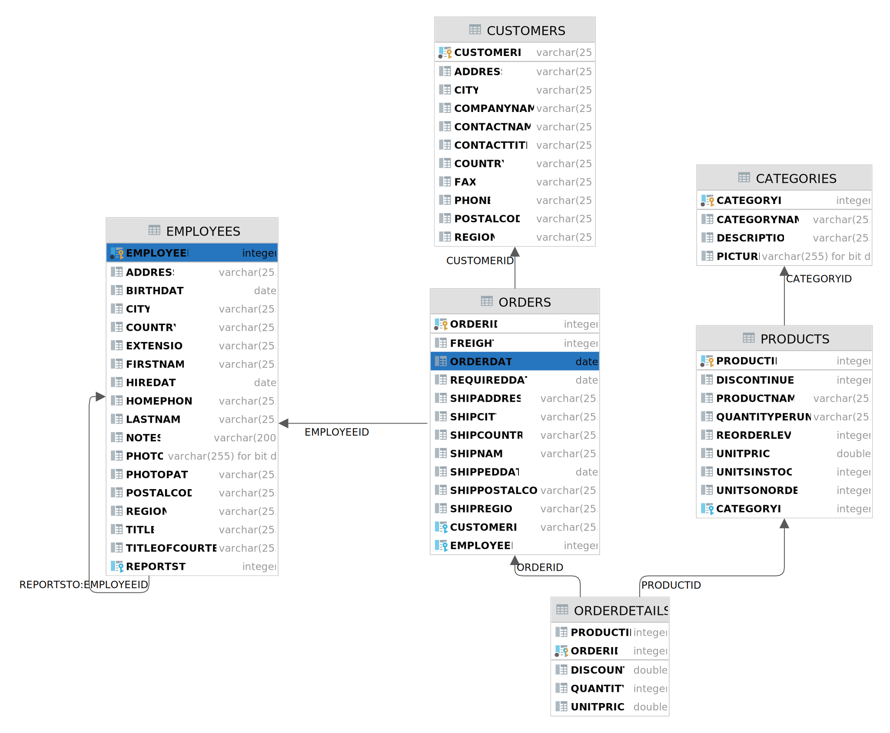

# Übung Northwind
:author: G. Aistleitner

## Einrichten des Projekts

.Schritte zur Projektkonfiguration
* Erstellen Sie ein neues Projekt in IntelliJ, indem Sie `File -> New -> Project from Version Control...` auswählen.
* Geben Sie folgende URL ein: `https://github.com/aisge/?????quarkus-jpa-start.git`

.Datenbank-Explorer einrichten (falls Apache Derby verwendet wird)
* Öffnen Sie die bereitgestellte Datei `datasource.txt` und kopieren Sie deren Inhalt in die Zwischenablage.
* Wechseln Sie rechts in den Abschnitt `Database`. Klicken Sie dort auf das Symbol `+` und wählen Sie in dem erscheinenden Menu `Import from Clipboard`.

## JPA-Entities generieren und Datenbank befüllen

.JPA-Entities erstellen
* Sie finden im Package `at.htl.model` POJOs mit den benötigten Attributen. Passen Sie diese Klassen dahingehend an, dass daraus gültige und mit der Datei import.sql kompatible Entities entstehen.
* Die Klassen dürfen nicht umbenannt werden, die Bezeichner für die Datenbankspalten sind ebenfalls nicht zu verändern!
* Achten Sie auf die vorhandenen TODOs, um die korrekten Beziehungen abzubilden!

.Datenbank mit Testdaten befüllen
* Wenn Sie das Projekt starten sollte die Datei `import.sql` in die Datenbank geladen werden. Dies wird nur funktionieren, wenn die Entities entsprechend angepasst wurden!

## Reports erstellen

Erstellen Sie ein Repository mit dem Namen `ReportRepository`.
Weiters erstellen Sie bitte eine REST-Resource mit dem Namen `ReportResource`. Mappen Sie die Url `/api/report/` auf diese Resource.

### Umsätze pro Jahr

Ermitteln Sie für jedes Jahr die Gesamtumsätze. +
Addieren Sie dazu die entsprechenden Einträge aus `OrderDetails`. Berücksichtigen Sie auch die gewährten Rabatte (`Discount`).

TIP: Versuchen Sie Records (JDK 16+) einzusetzen!

.Schnittstelle
REST:: GET /api/report/revenue_per_year
Result::
[source,json]
----
[
  {
    "year": 1996,
    "value": 208083.97
  },
  {
    "year": 1997,
    "value": 617085.2035
  },
  {
    "year": 1998,
    "value": 440623.866
  }
]
----
<<<
### ReOrder-Produkte

Ermitteln Sie alle Produke, für die folgendes gilt:

* Sie werden noch weiter geführt (discontinued gleich 0)
* Produkte sollen nachbestellt werden (reorderlevel > 0)
* Lagerbestand + bestellte Produkte sind weniger als das ReOrderLevel

.Schnittstelle
REST:: GET /api/report/reorder_products
Result::
[source,json]
----
[
  {
    "productid": 30,
    "productname": "Nord-Ost Matjeshering",
    "quantityperunit": "10 - 200 g glasses",
    "unitprice": 25.89,
    "unitsinstock": 10,
    "unitsonorder": 0,
    "reorderlevel": 15,
    "discontinued": 0,
    "category": { ... }
  },
  {
    "productid": 70,
    "productname": "Outback Lager",
    "quantityperunit": "24 - 355 ml bottles",
    "unitprice": 15.0,
    "unitsinstock": 15,
    "unitsonorder": 10,
    "reorderlevel": 30,
    "discontinued": 0,
    "category": { ... }
  }
]
----

### Mitarbeiter mit den meisten Bestellungen

Ermitteln Sie die Daten des Mitarbeiters, der die meisten Bestellungen erledigt hat.

.Schnittstelle
REST:: GET /api/report/employee_max_orders
Result::
[source,json]
----
{
  "employeeid": 4,
  "lastname": "Peacock",
  "firstname": "Margaret",
  "title": "Sales Representative",
  "titleofcourtesy": "Mrs.",
  "birthdate": "1937-09-19",
  ...
}
----

### Gesamt-Umsatz pro Produktkategorie

Ermitteln Sie die gesamten gespeicherten Umsätze pro Produktkategorie (Tabelle OrderDetails) +
Discounts (Rabatte) können dabei ignoriert werden!
Achten Sie darauf, dass evtl. vorkommende Produktkategorien ohne Umsätze bzw. ohne Produkte ebenfalls geliefert würden. +
Sortieren Sie das Ergebnis absteigend nach dem Umsatz.

.Schnittstelle
REST:: `GET /api/report/revenue_per_category`

<<<

Result::
[source,json]
----
[
  {
    "categoryname": "Beverages",
    "revenue": 286526.95
  },
  {
    "categoryname": "Dairy Products",
    "revenue": 251330.5
  },
  ....
]
----
